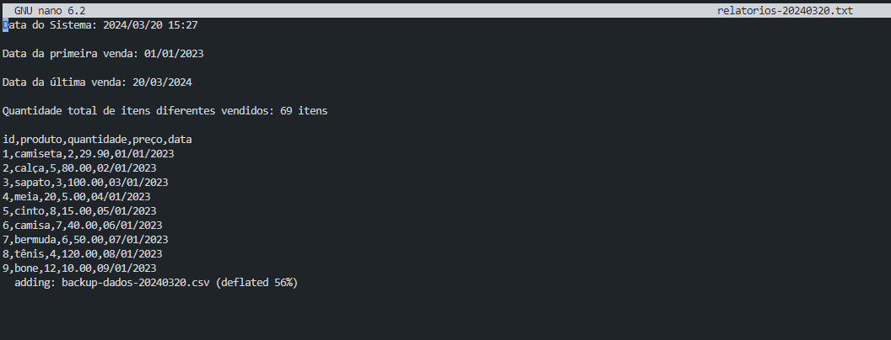

<!-- 
# Instruções

Neste arquivo você irá apresentar suas entregas da Sprint corrente. Observe que existem 4 diretórios no exemplo: **exercícios**, **certificados** e **evidências**.

 - O diretório **exercícios** corresponde ao local onde você irá adicionar o código-fonte das atividades de codificação da Sprint, quando houver.
 - O diretório **evidências** você pode utilizar para adicionar imagens demonstrando a execução/resultados de atividades, quando necessário.
 - O diretório **certificados** é o local onde você irá armazenar os certificados dos cursos solicitados durante a sprint. O nome de cada certificado de corresponder ao título do curso.
 - O diretório **desafio** é o local onde você irá armazenar a resolução do que se pede no desafio, todos recursos que você considerar importante deverá está dentro desse diretório.

Utilize o arquivo README.md da Sprint para organizar todas as suas entregas. Faça referência aos arquivos de código-fonte. Evite colocar código diretamente no Markdown pois dificulta nossa avaliação.
 -->

# Exercícios

Não houve exercícios nessa Sprint!

# Evidências

Ao executar o código do exercício **processamento_de_vendas.sh** observei que rodou perfeitamente, conforme podemos ver na imagem a seguir:

Parte do código **processamento_de_vendas.sh**

# Certificados

- Certificado do Curso Git e GitHub

- Certificado do Curso Linux

- Certificado do Curso AWS PB 1/10

