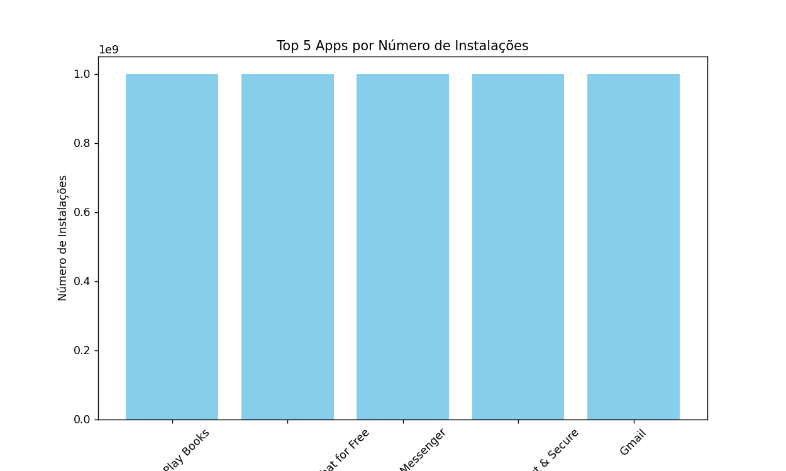
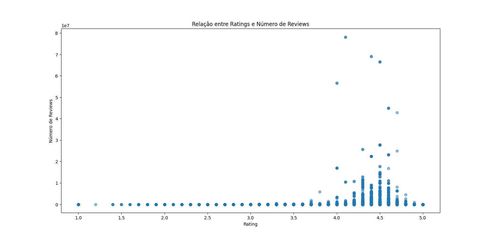
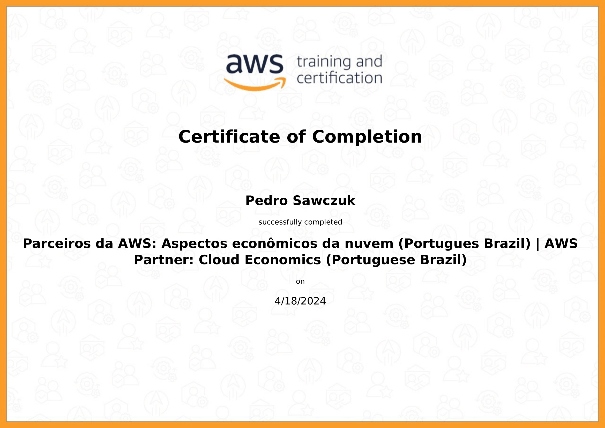

<!--
# Instruções

Neste arquivo você irá apresentar suas entregas da Sprint corrente. Observe que existem 4 diretórios no exemplo: **exercícios**, **certificados** e **evidências**.

 - O diretório **exercícios** corresponde ao local onde você irá adicionar o código-fonte das atividades de codificação da Sprint, quando houver.
 - O diretório **evidências** você pode utilizar para adicionar imagens demonstrando a execução/resultados de atividades, quando necessário.
 - O diretório **certificados** é o local onde você irá armazenar os certificados dos cursos solicitados durante a sprint. O nome de cada certificado de corresponder ao título do curso.
 - O diretório **desafio** é o local onde você irá armazenar a resolução do que se pede no desafio, todos recursos que você considerar importante deverá está dentro desse diretório.

Utilize o arquivo README.md da Sprint para organizar todas as suas entregas. Faça referência aos arquivos de código-fonte. Evite colocar código diretamente no Markdown pois dificulta nossa avaliação.
 -->

# Exercícios

Ao contrário da Sprint anterior, nessa houve alguns exercícios!

1. [Exercício 1](exercicios/ex-01.py)
2. [Exercício 2](exercicios/ex-02.py)

# Evidências

O código **desafio.sql** onde tinhamos que normalizar um banco de dados, funcionou perfeitamente! Como pode-se ver aqui:

# Certificados

- Certificado do AWS Partner

